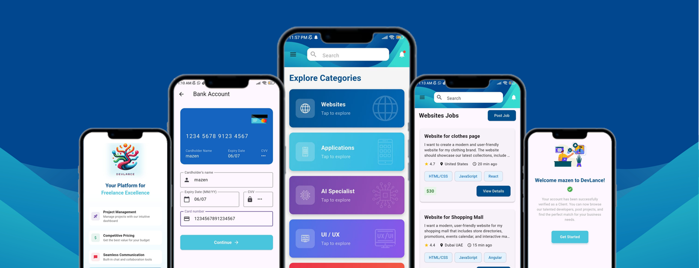

# [DevLance Live Demo](https://mo-zaghloul.github.io/DevLance.github.io/)
[]()
A Flutter-based freelancing app enabling clients to post jobs and negotiate payments with developers
## 📱 Mockups  
[]()

---

## ✨ Features  
- **Job Posting**: Clients create projects with budgets and skill requirements.  
- **Real-Time Chat**: In-app messaging for negotiations.  
- **Milestone Payments**: Secure payments with you visa.  
- **Role-Based Dashboards**: Tailored views for clients/developers.  

## 🛠️ Tech Stack  
- **Frontend**: Flutter (Android/iOS)  
- **Backend**: Firebase (Auth, Realtime DB, Cloud Functions)   
- **Tools**: Figma (UI/UX), Git (Version Control)  

---

## 🧑‍💻 Team  
| Role              | Name             | Contribution |  
|-------------------|------------------|-------------|  
| Team Leader     | Mohamed Zaghloul      | SRS, Architecture, Code Reviews |  
| Developer         | Youssef Mohamed/ Mazen Mamdouh       | Frontend, UI |  
| UI/UX Designer    | Mohamed Mahmoud        | Figma Prototypes |  
| Backend           | Ahmed Emad       | DB, SRS |  

---

## 📂 Project Structure  
```
lib/
  ├── core/           # Core utilities and constants
      ├── constants/  # Route names and app constants
  ├── models/         # Data models and DTOs
  ├── views/          # UI screens and widgets
      ├── auth/       # Authentication views
      ├── bank/       # Banking views
      ├── client/     # Client views
      ├── developer/  # Developer views
      ├── home/       # Home views
      ├── jobs/       # Job-related views
  ├── main.dart      # Application entry point
assets/              # Images, fonts, and other static files
```

---

## 📄 Documentation  
- [Software Requirements Specification (SRS)](https://docs.google.com/document/d/1cCVoeNSuWMo45ywLVAady4wu0jCLZ-bz/edit?usp=sharing&ouid=112046173294622162908&rtpof=true&sd=true)  
- [Figma Prototype](https://www.figma.com/design/9GzCDKo2ZkxenQb0mfUWyS/Application-Project?node-id=0-1&t=rlMxCpHvSPN8bBuK-1)
- [Presentation](https://www.canva.com/design/DAGmg8rIJbA/2QEdDFv2LcEZNIgI6FehTA/view?utm_content=DAGmg8rIJbA&utm_campaign=designshare&utm_medium=link2&utm_source=uniquelinks&utlId=h70227cf4ba)
  
## 🚀 Getting Started

1. Clone the repository
```bash
git clone https://github.com/yusf4u/flutter_project.git
```

2. Install dependencies
```bash
flutter pub get
```

3. Run the app
```bash
flutter run
```
  
